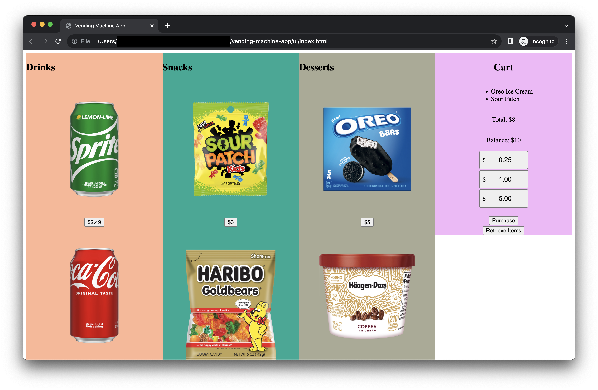
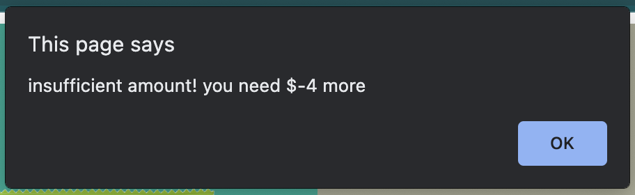

### About the Project
Vending Machines where you can buy snacks

### Items available for purchase 
- Oreo Ice Cream: $5
- Sour Patch: $3
- Sprite: $2.49

Payment | Purchase credit ($0.25, $1.00, $5.00)

### Tech Stacks:
- HTML
- CSS
- JS
- Python (aiohttp)

### Purpose:
- I want to increase my confidence on my technical skills to become a Software Engineer. 
- I can achieve this by learning the fundamentals of programming language and work on by building a full-stack project.

This is how the vending machine app looks like. You can:
- select the product
- add balance ($0.25, $1.00, and $5.00)
- Purchase the item(s)

And when you purchased the item(s), you need sufficient balance amount to be able to purchase. You will get a prompt when you succesfully purchase / failed to purchase.

